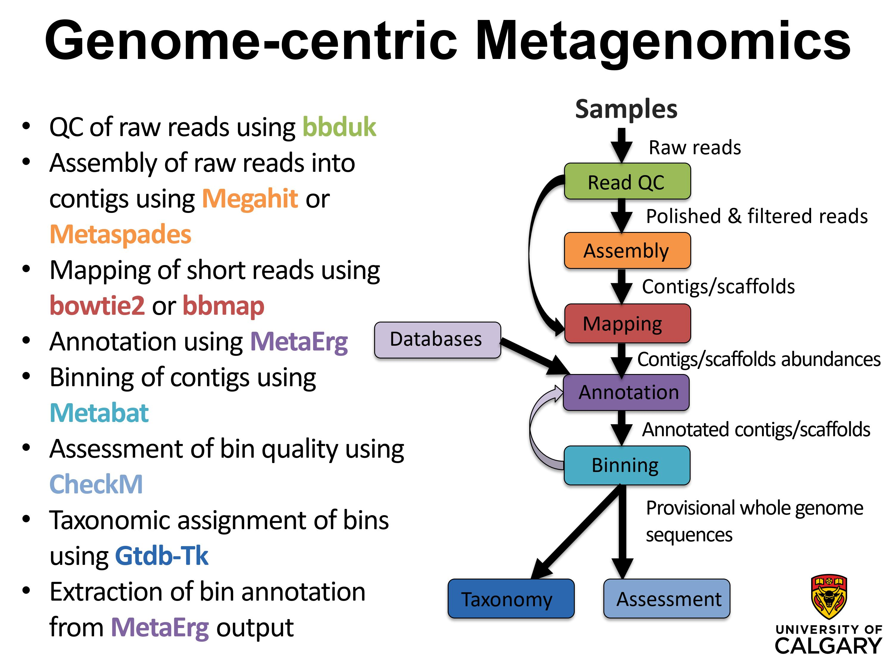

# EBG metagenomics crash course
This crash course is offered by [Marc Strous](https://www.ucalgary.ca/labs/ebg/people/marc-strous) to train our new graduate students and postdoctoral researchers in the [Energy Bioengineering and Geomicrobiology](https://www.ucalgary.ca/labs/ebg) group. This is a genome-centric metagenomics data analysis course, which teaches students and researchers how to obtain provisional whole genomes of individual populations from a mixed microbial community using shotgun metagenomics Illumina sequences. The tutorials of this course were prepared by [Xiaoli Dong](https://www.ucalgary.ca/labs/ebg/people/xiaoli-dong).  

 The workflow was prepared by Jackie Zorz.
  

## Table of contents
* [Requirements](https://github.com/xiaoli-dong/metagenomics_crash_course/blob/master/requirements.md#requirements)
* [Sequence quality assesment](https://github.com/xiaoli-dong/metagenomics_crash_course/tree/master/fastqc#sequence-quality-assesment)
* [Short read quality control](https://github.com/xiaoli-dong/metagenomics_crash_course/tree/master/qc)  
* [Metagenome assembly](https://github.com/xiaoli-dong/metagenomics_crash_course/tree/master/assembly)  
   * [MEGAHIT assembly](https://github.com/xiaoli-dong/metagenomics_crash_course/tree/master/assembly#assembly-of-qc-reads-with-megahit)  
   * [metaSPAdes assembly](https://github.com/xiaoli-dong/metagenomics_crash_course/tree/master/assembly#assembly-of-qc-reads-with-metaspades)  
   * [Co-assembly](https://github.com/xiaoli-dong/metagenomics_crash_course/tree/master/assembly#co-assembly)  
* [Short read mapping](https://github.com/xiaoli-dong/metagenomics_crash_course/tree/master/mapping)  
  * [BBMap mapping](https://github.com/xiaoli-dong/metagenomics_crash_course/tree/master/mapping#short-reads-mapping-using-bbmap)  
  * [Bowtie2 mapping](https://github.com/xiaoli-dong/metagenomics_crash_course/tree/master/mapping#short-reads-mapping-using-bowtie2)  
* Metagenome binning
  * [Metagenome binning using MeteBAT](https://github.com/xiaoli-dong/metagenomics_crash_course/blob/master/binning/README.md#metagenome-binning)  
  * [MAGs quality assesment using CheckM](https://github.com/xiaoli-dong/metagenomics_crash_course/blob/master/binning/bin_quality_assessment.md#mags-quality-assessment)
  * [MAGs taxonomy assignment using GTDBTk](https://github.com/xiaoli-dong/metagenomics_crash_course/blob/master/metagenome_bin_taxonomy_assignment.md#mags-taxonomy-assignment)  
* [Metagenome annotation](https://github.com/xiaoli-dong/metagenomics_crash_course/blob/master/annotation/README.md)
